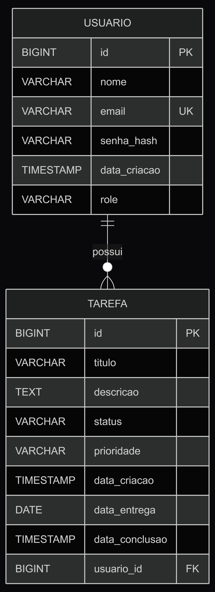

# Task Manager API

API REST para gerenciamento de tarefas desenvolvida com Java e Spring Boot.

A aplicação permite cadastrar usuários, realizar login com JWT e gerenciar tarefas com controle de acesso baseado em perfis. Usuários comuns acessam apenas suas próprias tarefas, enquanto administradores possuem permissões ampliadas dentro do sistema.

## Funcionalidades

- Cadastro e autenticação de usuários com JWT
- Criptografia de senha
- Controle de acesso com Spring Security
- Perfis de acesso `USER` e `ADMIN`
- Criação, listagem, atualização e exclusão de tarefas
- Conclusão de tarefas
- Filtro de tarefas por status e prioridade
- Consulta de usuários
- Tratamento centralizado de exceções
- Documentação interativa com Swagger
- Deploy com Docker no Render
- Banco PostgreSQL em produção

## Tecnologias

- Java 21
- Spring Boot
- Spring Web MVC
- Spring Security
- JWT
- Spring Data JPA
- Hibernate
- PostgreSQL
- H2 Database
- Maven
- Lombok
- Swagger / OpenAPI
- Docker
- Render

## Deploy

A API está hospedada no Render e a documentação pode ser acessada pelo Swagger:

[https://taskmanager-xlm1.onrender.com/swagger-ui/index.html](https://taskmanager-xlm1.onrender.com/swagger-ui/index.html)

> O serviço utiliza o plano gratuito do Render. A primeira requisição pode levar alguns segundos caso o servidor esteja em repouso.

## Arquitetura

O projeto é organizado em camadas, cada uma com responsabilidade bem definida:

```text
src/main/java/com/sergio/taskmanager
+-- auth
+-- config
+-- exception
+-- security
+-- tarefa
+-- usuario
```

- `auth`: cadastro, login e geração de token
- `security`: configuração de segurança, filtro JWT e autenticação
- `usuario`: regras, endpoints e persistência de usuários
- `tarefa`: regras, endpoints e persistência de tarefas
- `exception`: tratamento de erros da aplicação
- `config`: configurações auxiliares, como Swagger

## Banco de Dados

Em desenvolvimento, a aplicação utiliza H2 para facilitar os testes locais. Em produção, o banco é PostgreSQL.

As configurações sensíveis são carregadas por variáveis de ambiente:

```properties
spring.datasource.url=${DATABASE_URL}
spring.datasource.username=${DB_USERNAME}
spring.datasource.password=${DB_PASSWORD}
```

## Modelo Relacional



Cada usuário pode possuir várias tarefas, enquanto cada tarefa pertence a um único usuário. O campo `role` no usuário diferencia os perfis `USER` e `ADMIN`.

## Acesso para Teste

Dois usuários já estão cadastrados no banco:

```
ADMIN
Email: admin@taskmanager.com
Senha: admin123
```

```
USER
Email: user@taskmanager.com
Senha: user123
```

Para testar rotas protegidas pelo Swagger:

1. Acesse o endpoint `/auth/login`
2. Faça login com uma das contas acima
3. Copie o token retornado
4. Clique em **Authorize**
5. Informe o token no formato:

```
Bearer seu_token_aqui
```

## Endpoints

### Autenticação

| Método | Endpoint | Descrição |
|--------|----------|-----------|
| POST | `/auth/register` | Cadastra um novo usuário |
| POST | `/auth/login` | Realiza login e retorna um token JWT |

### Usuários

| Método | Endpoint | Descrição |
|--------|----------|-----------|
| GET | `/usuario/me` | Retorna os dados do usuário autenticado |
| GET | `/usuario` | Lista todos os usuários |
| GET | `/usuario/{id}` | Busca um usuário por ID |
| POST | `/usuario` | Cria um usuário |
| PUT | `/usuario` | Atualiza o usuário autenticado |
| PUT | `/usuario/{id}` | Atualiza um usuário por ID |
| DELETE | `/usuario/{id}` | Remove um usuário |

### Tarefas

| Método | Endpoint | Descrição |
|--------|----------|-----------|
| POST | `/tarefa` | Cria uma tarefa para o usuário autenticado |
| POST | `/tarefa/{id}` | Cria uma tarefa para um usuário específico |
| GET | `/tarefa` | Lista tarefas |
| GET | `/tarefa/{id}` | Busca uma tarefa por ID |
| GET | `/tarefa/filtrar` | Filtra tarefas por status e prioridade |
| GET | `/tarefa/usuario/{usuarioId}` | Lista tarefas de um usuário específico |
| PUT | `/tarefa/{id}` | Atualiza uma tarefa |
| PATCH | `/tarefa/{id}/concluir` | Marca uma tarefa como concluída |
| DELETE | `/tarefa/{id}` | Remove uma tarefa |

## Exemplos de Requisição

### Login

```json
{
  "email": "user@taskmanager.com",
  "senha": "user123"
}
```

### Criar Tarefa

```json
{
  "titulo": "Revisar documentação da API",
  "descricao": "Conferir exemplos de uso e endpoints no Swagger",
  "status": "PENDENTE",
  "prioridade": "ALTA",
  "dataEntrega": "2026-06-01"
}
```

### Criar Usuário

```json
{
  "nome": "Usuario Teste",
  "email": "teste@taskmanager.com",
  "senha": "teste123",
  "role": "USER"
}
```

## Status e Prioridades

**Status disponíveis:**

```
PENDENTE
EM_ANDAMENTO
CONCLUIDA
```

**Prioridades disponíveis:**

```
BAIXA
MEDIA
ALTA
```

## Como Rodar Localmente

Clone o repositório:

```bash
git clone <url-do-repositorio>
```

Entre na pasta do projeto:

```bash
cd taskmanager
```

Execute com Maven Wrapper:

```bash
# Linux/macOS
./mvnw spring-boot:run

# Windows
mvnw.cmd spring-boot:run
```

A aplicação estará disponível em `http://localhost:8080`.

## Docker

O projeto inclui um `Dockerfile` utilizado no deploy no Render. A aplicação roda dentro de um container com Java 21, garantindo um ambiente de execução consistente entre desenvolvimento e produção.
